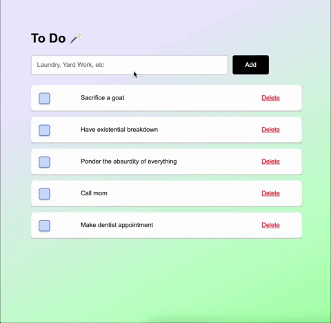

# SQL TO-DO

## Description

_Duration: 6 hours_

This was one of the first applications I made, 9 weeks into learning how to code and three days of learning SQL.

I was asked to create an application that allows a user to create a task, add it to a list, update task status to finished and delete tasks. 

Once user input is submitted using a submit button, the app collects the information and stores it to a database. Information is then refreshed and the added task is displayed on the webpage. 

## Demo

 
To see the fully functional site, click [here]().

## Built With

-Javascript 
-Jquery 
-CSS 
-HTML 
-Node.js 
-postgreSQL

## Acknowledgement
Thanks to [Prime Digital Academy](www.primeacademy.io) who equipped and helped me to make this application a reality. Huge thanks to my peers in the Gaiman cohort for their unwavering support- I couldn't have done it without them. Hugs and love to my friends and family for being patient with me while I immersed myself in the software world and had little time for anything else. 

## Support
If you have suggestions or issues, please email me at jmbranstrator@gmail.com
